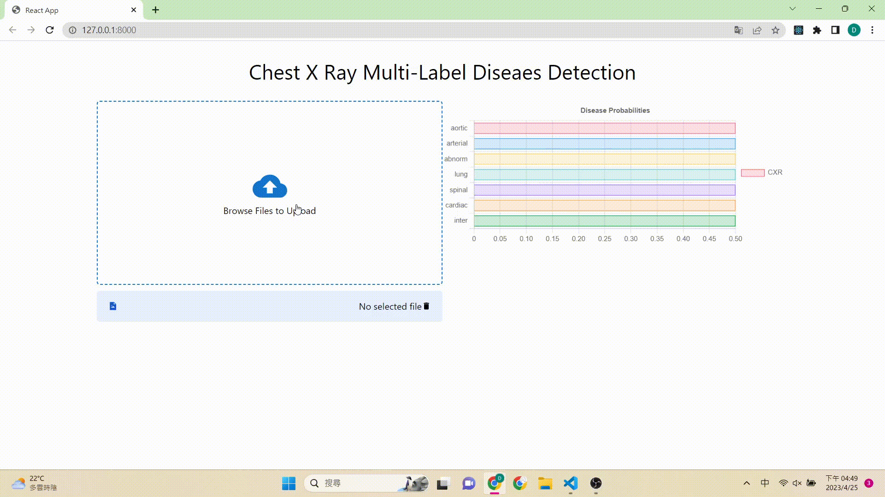

# CXR Multi-Label Classification Model

本篇紀錄如何部屬一個影像 AI 模型至網頁應用

## Configuration

主要參數如下

1. Backbone: CoatNet1
2. Image Size: 224
3. Learning Rate: 1e-5
4. Weight decay: 1e-4
5. Scheduler: ReduceLROnPleatu
6. Epochs: 50
7. Loss Function: Weighted Focal Loss

## Frontend

前端我使用 React 框架，這次專案的主要挑戰為將影像資料傳送給後端

傳送資料使用的是 axios，數據呈現使用 react-chartjs

```java
<form
  className="overflow-auto w-full h-full"
  action=""
  onClick={() => document.querySelector(".input-field").click()}
>
  <input
    type="file"
    accept="image/*"
    className="input-field"
    hidden
    onChange={({ target: { files } }) => {
      files[0] && setFileName(files[0].name);
      const image = files[0];
      if (image) {
        setImage(URL.createObjectURL(image));
        const formData = new FormData();
        formData.append("image", image);
        axios({
          method: "post",
          url: "/api/v1/CXRNet/predict",
          headers: {
            "Content-Type": "multipart/form-data",
          },
          data: formData,
        })
          .then((response) => {
            setEncodedImage(
              `data:image/jpeg+jpg+png;base64,${response.data.gradcam}`
            );
            console.log(response.data);
            setResponse(response.data);
          })
          .catch((error) => {
            console.log(error);
          });
      }
    }}
  />
  {encodedImage ? (
    
  ) : (
    <>
      <MdCloudUpload color="#1475cf" size={60} />
      <p>Browse Files to Upload</p>
    </>
  )}
</form>
```

### Upload Image

將影像資料傳輸給後端有兩種主要方式

1. 使用 base64
2. 使用 FormData

FormData 使用的類似 (query, key) 的鍵值對

```js
const image = files[0];
setImage(URL.createObjectURL(image));
const formData = new FormData();
formData.append("image", image);
```

後端我們只需要使用以下方式讀取影像

```python
image = request.data["image"].read()
image = np.fromstring(image, np.uint8)
image = cv2.imdecode(image, cv2.IMREAD_COLOR)[:,:,::-1]
image = np.array(image)
```

## Backend

後端我使用的是 django 框架，參考 [https://www.deploymachinelearning.com/train-ml-models/](https://www.deploymachinelearning.com/train-ml-models/) 部屬 AI 模型

這篇文章介紹如何用 Django 搭建 AI 的 RESTful API

建立完成後端之後就可以將 AI 預測的醫學影像回傳給前端渲染

```python
class CXRClassifier:
    def __init__(self):

        state_dict = torch.load("collectedstatic/model/0.8960.pth", map_location="cpu")
        self.model = CXRNet()
        self.model.load_state_dict(state_dict)
        self.transform = transform
        self.logits_to_prob = nn.Sigmoid()

    def preprocessing(self, input_data):
        self.image_buffer = input_data
        try:
            logits = self.transform(image=input_data)["image"]
        except:
            raise KeyError("Invalid input data")

        return logits.unsqueeze(0)

    def predict(self, input_data):
        heatmap = gradcam(self.image_buffer, self.model)
        heatmap = Image.fromarray(heatmap)
        self.image_buffer = self.__pil2base64(heatmap)
        return self.model(input_data)

    def postprocessing(self, input_data):
        answer = self.logits_to_prob(input_data)[0]
        return {
            "answer": answer,
            "gradcam": self.image_buffer,
            "category": ['主動脈硬化(鈣化)','動脈彎曲','肺野異常','肺紋增加','脊椎病變','心臟肥大','肺尖肋膜增厚'],
            "status": "OK"
        }


    def __pil2base64(self, image):
        img_buffer = BytesIO()
        image.save(img_buffer, format="JPEG")
        byte_data = img_buffer.getvalue()
        base64_str=base64.b64encode(byte_data)
        return base64_str

    def compute_prediction(self, input_data):

        try:
            input_data = self.preprocessing(input_data)
            prediction = self.predict(input_data)  # only one sample
            prediction = self.postprocessing(prediction)
        except Exception as e:
            return {"status": "Error", "message": str(e)}

        return prediction
```

### Image Response

我們回傳影像的方式是使用 base64 方式儲存影像

Note: 我們必須先將影像陣列轉成 PIL 物件再轉成 base64，不然無法在前端正確顯示

在前端，我們只需要使用 ```setEncodedImage(`data:image/jpeg+jpg+png;base64,${response.data.gradcam}`)``` 的方式讀取影像就 OK 了

```js
axios({
  method: "post",
  url: "/api/v1/CXRNet/predict",
  headers: {
    "Content-Type": "multipart/form-data",
  },
  data: formData,
})
  .then((response) => {
    setEncodedImage(`data:image/jpeg+jpg+png;base64,${response.data.gradcam}`);
    setResponse(response.data);
  })
  .catch((error) => {
    console.log(error);
  });
```

## Docker 

最後一步驟是在 Docker 上建立 Images 和 Container

### Dockerfile

```docker
# Use an official Python runtime as a parent image
FROM python:3.8-slim-buster

# Set the working directory to /app
WORKDIR /app

# Copy the requirements file into the container at /app
COPY requirements.txt /app/

# Install the required packages
RUN pip install --no-cache-dir -r requirements.txt

RUN apt-get update && apt-get install -y python3-opencv
RUN pip install opencv-python

# Copy the backend code into the container at /app
COPY . /app/

# Install Node.js and npm
RUN apt-get install -y curl
RUN curl -sL https://deb.nodesource.com/setup_14.x | bash -
RUN apt-get install -y nodejs

# Change the working directory to the frontend
WORKDIR /app/frontend

# Install the required packages for the frontend
RUN npm install

# Build the frontend
RUN npm run build

# Change the working directory back to /app
WORKDIR /app

# Expose the port the application will run on
EXPOSE 8000

# Start the Django development server and the React app
# CMD ["sh", "-c", "python manage.py makemigrations"]
# CMD ["sh", "-c", "python manage.py migrate"]
CMD ["sh", "-c", "python manage.py runserver 0.0.0.0:8000 & cd frontend && npm run start"]
```

這裡需要提醒的是 server 的 IP 必須開在 0.0.0.0，port 不能被占用

如果你 IP 開在 127.0.0.1 雖然 container 內 django 會運行在 127.0.0.1 沒錯，但是你本機無法直接連接到 container 的 IP 位置，而是會透過他的其他網路 IP，所以我們必須將 IP 開在 0.0.0.0 讓他監聽所有端口

## Usage

```sh
docker build -t cxr .
docker run -p 8000:8000 cxr
```

